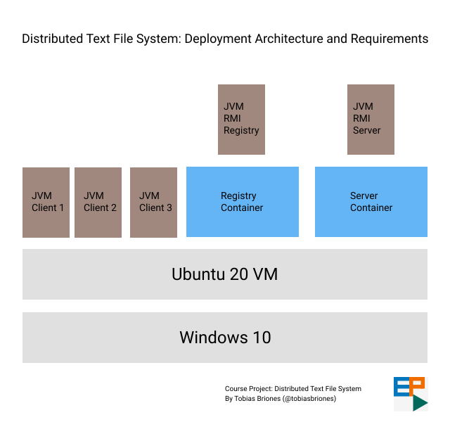
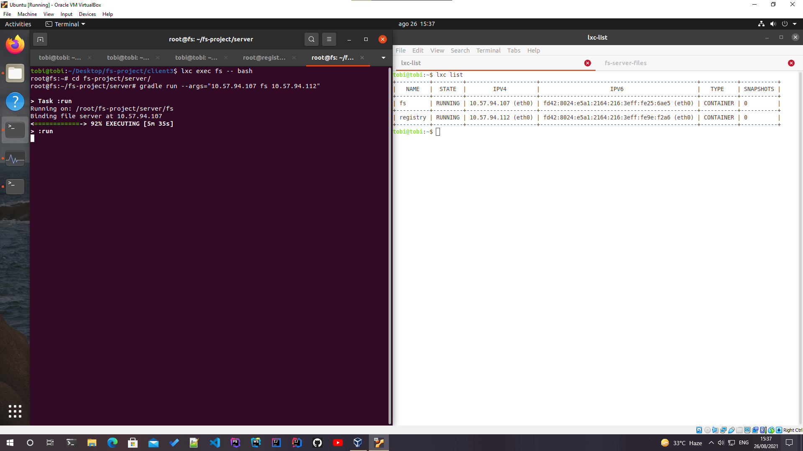
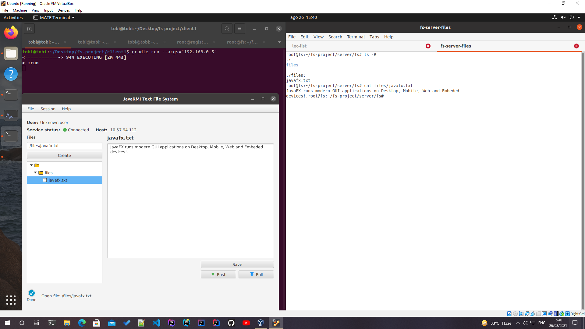

<!-- Copyright (c) 2021 Tobias Briones. All rights reserved. -->
<!-- SPDX-License-Identifier: BSD-3-Clause -->
<!-- This file is part of https://github.com/tobiasbriones/cp-unah-mm545-distributed-text-file-system -->

<!-- Project Author: Tobias Briones -->

# Course Project at UNAH-MM545: Distributed Text File System

Implementation of a server/client application in Java RMI and JavaFX to manage
concurrent connections for managing a file system that accepts operations on
users' text files.

The project name is shorted as **DTFS (Distributed Text File System)** so it 
can be used into the source code, for example: domain module `dtfs`, main 
package `engineer.mathsoftware.cp.dtfs`, etc.

The original course project required a much simpler implementation, and the main
objective was to apply DevOps skills. Needless to say, as I often do, I have
added a huge amount of extra value to this project to make it worth it. My
objectives are to keep working on some new features after the initial release
and build good DevOps documentation. Additionally, it's a good chance to show
good use cases of the main underlying technologies: Java and JavaFX.

## Required Technologies

- Java RMI or Python Pyro only.
- Anything that works for the client.
- Linux containers.

## Get Started

This system can be deployed in several ways. According to the course topics, you
should use linux containers for the server applications. For this server, there
are two applications that run the distributed system:

- **RMI Registry:** Receives the request from clients to connect to the remote
  object from the file server.

- **RMI File System Server:** Manages the actual file system and physical files
  in storage. The clients access the remote object of this application through
  the RMI Registry, so the registry may be deployed separately from the server
  storing the actual files.

On the other side, for the client application you should run three or more of
them to show the real time functionality.

One way to deploy all the system is as a standalone fashion. This way you need
tons of RAM to run many VMs, JVMs, Linux Containers and other open applications
as depicted by the following diagram:

In that case, I would even suggest trying to use GraalVM to avoid that crazy
amount of JVMs. That is something I haven't tested yet and the project at this
stage is quite unstable. GraalVM also doesn't play well with the latest non-LTS
Java versions and just properly deploying JavaFX is a bit of a mess by itself
these days mostly if you use the latest versions of tools prior waiting for
issue fixes. 

So let's keep that game for later with Java 17 LTS since I am also
using `JDK 16` + `--enable-preview` as a good mathematician to take advantage of
the new data oriented and FP features for the *model* (or domain) layer.

Now I've moved the project forward to Java 17 (still with preview features) 
so I expect that the ultimate version of this project will run with Java 21 
LTS or later. 

For this version of the software, you need to do some manual configs regarding
IP addresses or hostnames. This is because the RMI technology requires knowing
not only the server hostname where the JVM is running but also the client's
hostname to answer back to it. If the hostname property isn't set on the client
app then the server won't be able to respond to that client, or it might take a
huge amount of time to respond. Fortunately, everything is set up already, and
the config process just requires a bit of work.

### Run in Development Mode

Check [Deployment](#deployment) for info while this section is updated with a
dead simple test environment.

### Suggested Reading

In [this article](docs/troubleshooting/binary-incompatibility), I talk about an
experience I had with the famous binary compatibility. This happens when you
update a software (library, etc.) to other version with binary breaking changes.
For instance, changing a method signature; in that case, all the library clients
have to recompile their classes and if they had serialized and persisted objects
of that class then we got troubles.

### Issues

One of the main issue of `v0.1.0` is the local FS update regarding deleting
files. When a user deletes a file form the system, it's physically deleted from
the user machine but not physically deleted from the other client machines. This
feature will be implemented in a further project version. Significant
performance optimizations will be scheduled for later releases too.

## Deployment

Go to the [deployment](docs/deployment) documentation.

## Screenshots

**LXC and Registry Container**

**LXC and FS container**

**Client running and FS Server files**

**Demo Animation**

## Contact

This project:
[Docs](https://tobiasbriones.github.io/cp-unah-mm545-distributed-text-file-system)
,
[Repository](https://github.com/tobiasbriones/cp-unah-mm545-distributed-text-file-system)

Tobias Briones: [GitHub](https://github.com/tobiasbriones)

## About

**Course Project at UNAH-MM545: Distributed Text File System**

Implementation of a server/client application in Java RMI and JavaFX to manage
concurrent connections for managing a file system that accepts operations on
users' text files.

Copyright © 2021-2022 Tobias Briones. All rights reserved.

### License

This project implementation is licensed under
the [BSD 3-Clause License](LICENSE).

---

This project's original specification is provided "AS IS"
at [./docs/course](docs/course).
