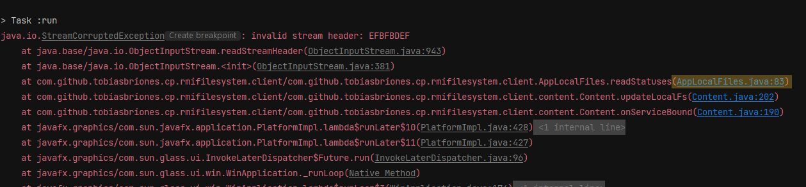

<!-- Copyright (c) 2021 Tobias Briones. All rights reserved. -->
<!-- SPDX-License-Identifier: BSD-3-Clause -->
<!-- This file is part of https://github.com/tobiasbriones/cp-unah-mm545-distributed-text-file-system -->

# Binary Incompatibility Issues

Many features haven't been implemented in Java because of binary compatibilities. A clear case of
this problem regarding this application is the following scenario:

Check
out [this commit](https://github.com/tobiasbriones/cp-unah-mm545-distributed-text-file-system/commit/4eb1ab7787f96720097075e52b6250c38606671c)
where I renamed the package names to replace the `io.github.tobiasbriones`
to `com.github.tobiasbriones`. Since the fully-qualified class names are changing then the objects
that are serialized, say
the [FileSystem](https://github.com/tobiasbriones/cp-unah-mm545-distributed-text-file-system/blob/v0.1.0/model/src/main/java/com/github/tobiasbriones/cp/rmifilesystem/model/io/node/FileSystem.java)
itself, will not be compatible with the serialized version of existing clients where the
fully-qualified class name starts with `io.`. This also implies that for example, many other modules
depend on the model module and will have to compile their classes again due to the public facing
change that was introduced.

Then one of the obvious solutions is to clean up the app local data and start fresh and new again.
This is not a viable option for production systems!. When I ran the client app after that commit I
got an expected error:

**StreamCorruptedException**

Due to opening an invalid version of the binary serialized object `fs.data` representing the past "
io." version of the FileSystem class.

Hence, Java is the language of choice for enterprise applications by allowing clients to rely on
further versions of the language and not dealing with tons of breaking changes. Breaking changes
many times don't even add any new value to the software, but you still have to manage them. Because
of this, the Java architects design pretty carefully new features added to the language (and not add
helpless trendy or domain-specific stuff), because once added, it is quite impossible to get rid of
them if you got it wrong. That's why there are many bloated languages out there that have to carry
old mistakes forever (or introduce breaking changes all the time) and that's a way to measure
whether a programming language has aged well.

My job is also to carefully design robust systems. This leads us to the conclusion that before a
stable release (a.k.a. v1.0.0) the public API must be well-defined and tested to avoid troubles in
the future.  
