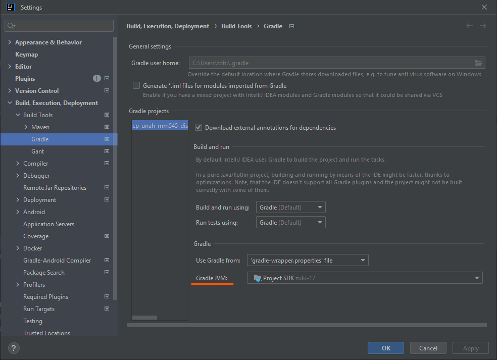

<!-- Copyright (c) 2022 Tobias Briones. All rights reserved. -->
<!-- SPDX-License-Identifier: BSD-3-Clause -->
<!-- This file is part of https://github.com/tobiasbriones/cp-unah-mm545-distributed-text-file-system -->

# Fix IntelliJ Gradle JVM

When I opened up the project after a long while, I had a problem to build the
modules.

After debugging the build output I found I was using another JDK version for
Java 8. Since I'm using the Gradle that has IntelliJ, I changed the Gradle JVM
version like so:

To find that error I had to use some options to print stacktrace or have more
detailed verbose output messages and found the problem that the JDK version that
appeared was not the right one.
