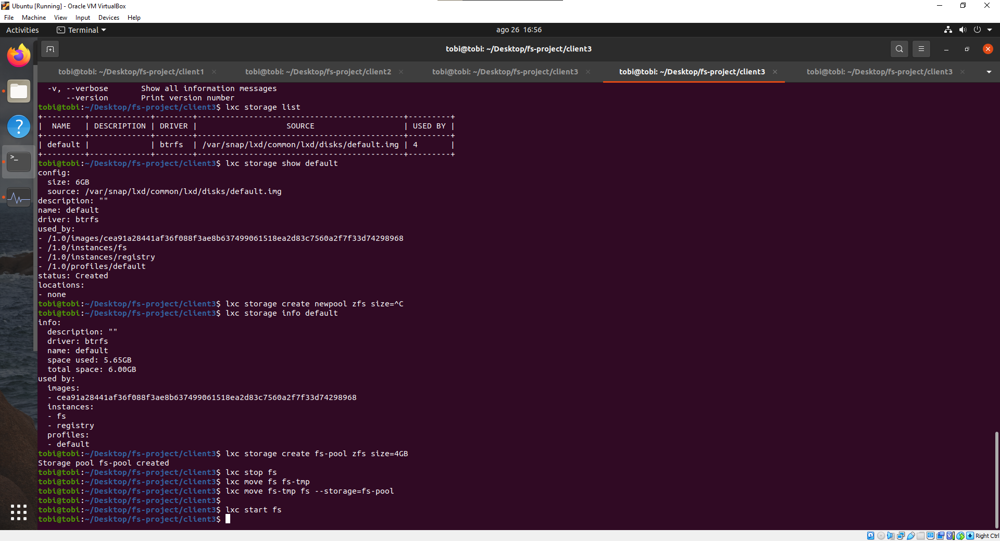
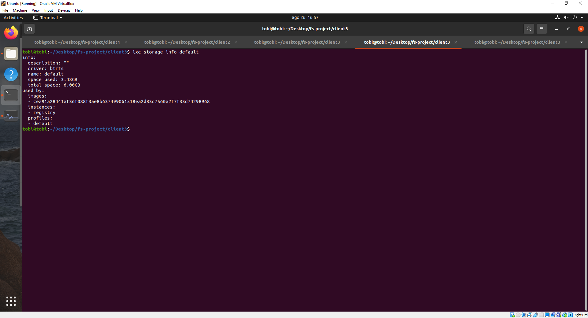

# Storage Issues

If a linux container gets out of space, you might experience a similar error when running a Java
application:

```
Starting a Gradle Daemon, 2 busy Daemons could not be reused, use --status for details

FAILURE: Build failed with an exception.

* What went wrong:
Unable to start the daemon process.
This problem might be caused by incorrect configuration of the daemon.
For example, an unrecognized jvm option is used.
Please refer to the User Manual chapter on the daemon at https://docs.gradle.org/7.1.1/userguide/gradle_daemon.html
Process command line: /root/.sdkman/candidates/java/16.0.1-open/bin/java --add-opens java.base/java.util=ALL-UNNAMED --add-opens java.base/java.lang=ALL-UNNAMED --add-opens java.base/java.lang.invoke=ALL-UNNAMED --add-opens java.base/java.util=ALL-UNNAMED --add-opens java.prefs/java.util.prefs=ALL-UNNAMED --add-opens java.prefs/java.util.prefs=ALL-UNNAMED --add-opens java.base/java.nio.charset=ALL-UNNAMED --add-opens java.base/java.net=ALL-UNNAMED --add-opens java.base/java.util.concurrent.atomic=ALL-UNNAMED -XX:MaxMetaspaceSize=256m -XX:+HeapDumpOnOutOfMemoryError -Xms256m -Xmx512m -Dfile.encoding=UTF-8 -Duser.country -Duser.language=en -Duser.variant -cp /root/.sdkman/candidates/gradle/7.1.1/lib/gradle-launcher-7.1.1.jar org.gradle.launcher.daemon.bootstrap.GradleDaemon 7.1.1
Please read the following process output to find out more:
-----------------------

FAILURE: Build failed with an exception.

* What went wrong:
java.io.IOException: No space left on device

* Try:
Run with --info or --debug option to get more log output. Run with --scan to get full insights.

* Exception is:
org.gradle.api.UncheckedIOException: java.io.IOException: No space left on device
        at org.gradle.internal.UncheckedException.throwAsUncheckedException(UncheckedException.java:61)
        at org.gradle.internal.UncheckedException.throwAsUncheckedException(UncheckedException.java:41)
        at org.gradle.cache.internal.DefaultFileLockManager.lock(DefaultFileLockManager.java:113)
        at org.gradle.cache.internal.DefaultFileLockManager.lock(DefaultFileLockManager.java:96)
        at org.gradle.cache.internal.DefaultFileLockManager.lock(DefaultFileLockManager.java:91)
        at org.gradle.cache.internal.OnDemandFileAccess.updateFile(OnDemandFileAccess.java:51)
        at org.gradle.cache.internal.SimpleStateCache.update(SimpleStateCache.java:87)
        at org.gradle.cache.internal.FileIntegrityViolationSuppressingPersistentStateCacheDecorator$1.create(FileIntegrityViolationSuppressingPersistentStateCacheDecorator.java:50)
        at org.gradle.cache.internal.FileIntegrityViolationSuppressingPersistentStateCacheDecorator.doUpdate(FileIntegrityViolationSuppressingPersistentStateCacheDecorator.java:67)
        at org.gradle.cache.internal.FileIntegrityViolationSuppressingPersistentStateCacheDecorator.update(FileIntegrityViolationSuppressingPersistentStateCacheDecorator.java:47)
        at org.gradle.launcher.daemon.registry.PersistentDaemonRegistry.store(PersistentDaemonRegistry.java:232)
        at org.gradle.launcher.daemon.server.DaemonRegistryUpdater.onStart(DaemonRegistryUpdater.java:80)
        at org.gradle.launcher.daemon.server.Daemon.start(Daemon.java:171)
        at org.gradle.launcher.daemon.bootstrap.DaemonMain.doAction(DaemonMain.java:125)
        at org.gradle.launcher.bootstrap.EntryPoint.run(EntryPoint.java:50)
        at java.base/jdk.internal.reflect.NativeMethodAccessorImpl.invoke0(Native Method)
        at java.base/jdk.internal.reflect.NativeMethodAccessorImpl.invoke(NativeMethodAccessorImpl.java:78)
        at java.base/jdk.internal.reflect.DelegatingMethodAccessorImpl.invoke(DelegatingMethodAccessorImpl.java:43)
        at java.base/java.lang.reflect.Method.invoke(Method.java:567)
        at org.gradle.launcher.bootstrap.ProcessBootstrap.runNoExit(ProcessBootstrap.java:60)
        at org.gradle.launcher.bootstrap.ProcessBootstrap.run(ProcessBootstrap.java:37)
        at org.gradle.launcher.daemon.bootstrap.GradleDaemon.main(GradleDaemon.java:22)
Caused by: java.io.IOException: No space left on device
        at java.base/java.io.RandomAccessFile.writeBytes(Native Method)
        at java.base/java.io.RandomAccessFile.write(RandomAccessFile.java:557)
        at org.gradle.internal.io.RandomAccessFileOutputStream.write(RandomAccessFileOutputStream.java:46)
        at java.base/java.io.BufferedOutputStream.flushBuffer(BufferedOutputStream.java:81)
        at java.base/java.io.BufferedOutputStream.flush(BufferedOutputStream.java:142)
        at java.base/java.io.DataOutputStream.flush(DataOutputStream.java:128)
        at org.gradle.cache.internal.filelock.LockInfoAccess.writeLockInfo(LockInfoAccess.java:63)
        at org.gradle.cache.internal.filelock.LockFileAccess.writeLockInfo(LockFileAccess.java:48)
        at org.gradle.cache.internal.DefaultFileLockManager$DefaultFileLock.lock(DefaultFileLockManager.java:323)
        at org.gradle.cache.internal.DefaultFileLockManager$DefaultFileLock.<init>(DefaultFileLockManager.java:164)
        at org.gradle.cache.internal.DefaultFileLockManager.lock(DefaultFileLockManager.java:110)
        ... 19 more
```

That happened to me just before the last steps when testing the system the last time, and the client
applications stopped working since the servers went down!. When running `lxc init` at the beginning
I accepted the default 6 GB storage pool and that wasn't enough!. I realized that my LXC storage
pool was out of space. The solution is to create a new storage pool and move the container(s) to the
new larger pool:



Then the server will go back to function properly. I just moved the `fs` container from the default
pool to the new pool, and so I left much more free space on the default pool for the `registry`
container:



The following commands may be useful:

- `lxc storage list`
  
- `lxc storage show default`
  
- `lxc storage info default`

- `lxc storage create { pool-name } zfs --size={ pool-size }GB`

To move a container to another pool:

`lxc stop { container }`

`lxc move { container } { container }-tmp`

`lxc move { container }-tmp { container } --storage={ pool }`

`lxc start { container }`

# Bibliography

- F. (2019, November 7). Change Storage (Size and Driver). Linux Containers
  Forum. https://discuss.linuxcontainers.org/t/change-storage-size-and-driver/6097
